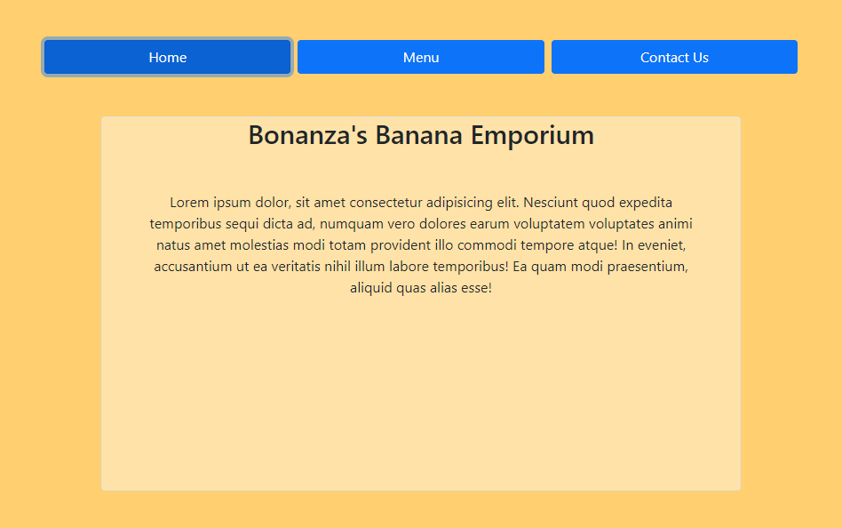

# Restaurant Page
A project based on JS DOM manipulation and modules system. The project allows users to view a template website for a restaurant and use buttons to switch up the displayed information without changing the page destination.


## Project Decription
A lightweight JavaScript project that allows users to interact with a page based mainly on JS.
Users can visit the website to get informatino about the restaurant, view their menu and access the business' contact information and address.


## Project Design
The project automatically starts on Home tab, where the basic description of the restaurant is located.
Users can also click on buttons provided on the top side of the screen to switch between Home, Menu and Contact tabs as they wish.
Every tab cleans out the main contents of the page and replaces it with the desired tab's content.

## Screenshot of the page



## Build With

- HTML
- CSS
- JAVASCRIPT
- SASS
- BOOTSTRAP


## Getting Started

1. Open Terminal.
2. Navigate to your desired location to download the contents of this repository.
3. Copy and paste the following code into the Terminal: git clone https://github.com/Zibilyonik/restaurant-page/tree/restaurant
4. ```cd restaurant-page```.
5. Install the required node modules by running `npm install` command.
6. After installing all the required node modules, you can run the project on your own server or just use the index.html file to preview it.


## Contributors

👤 **Onur Onat Surmeli**

- [GitHub](https://github.com/Zibilyonik)
- [Twitter](https://twitter.com/OnurSurmeli2)
- [LinkedIn](https://www.linkedin.com/in/onuronatsurmeli/)


## 🤝 Contributing

Contributions, issues and feature requests are welcome!

Feel free to check the [issues page](issues/).

## Show your support

Give a ⭐️ if you like this project!

